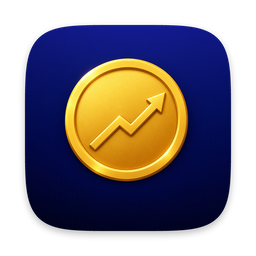
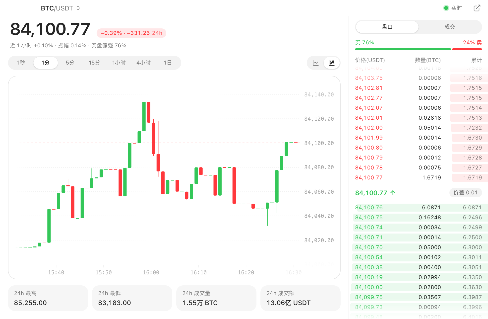

<p align="center">
  
</p>

<h1 align="center">Candlewick</h1>

<p align="center">在 macOS 菜单栏或 Windows 任务栏里看加密货币和股票的实时价格，带实时行情图、盘口和成交。</p>

<p align="center">
  <a href="https://github.com/gtoxlili/candlewick/releases/latest"></a>
  
  
  <a href="LICENSE"></a>
</p>

<p align="center"><a href="README.md">English</a></p>

Candlewick 把加密货币和股票的实时价格放在 macOS 菜单栏里，或者 Windows 任务栏的时钟旁边。加密货币用的是交易所的公开行情，币安、Bybit、OKX 三选一，任意现货交易对都能看，不需要账号。美股、港股和 A 股来自长桥，用你自己的 OpenAPI 凭证。点下拉菜单里的任意一个，就能打开随每笔成交跳动的行情图。

<picture>
  <source media="(prefers-color-scheme: dark)" srcset="assets/chart-dark.png">
  
</picture>

## 功能

- 在菜单栏或任务栏上固定一个标的，可以附带名称和涨跌幅，下拉菜单列出全部自选
- 最多 30 个，加密货币和股票放在一起：所选交易所的任意现货交易对，以及按代码添加的股票（AAPL、700、600519）
- 在设置里选币安、Bybit 或 OKX；换交易所时，自选里原交易所的币对会被移除
- 填上交易所的 API Key，下拉菜单最上面显示总资产和 24 小时涨跌，持仓窗口按交易所列出现货、资金、理财和合约仓位
- 折线图或 K 线随每笔成交更新，加密货币周期从 1 秒到 1 天，股票从 1 分钟到 1 周。拖动回看历史，滚动或双指捏合缩放
- 盘口和买卖力量对比，以及实时的最近成交
- 美股盘前、盘后和夜盘
- 绿涨红跌或红涨绿跌，开机自动启动
- 自动更新：新版本在后台下载，锁屏或显示器关闭时重新启动完成更新

## 安装

### macOS

从[最新版本](https://github.com/gtoxlili/candlewick/releases/latest)下载 `Candlewick_<版本>_aarch64.dmg`，打开后把 Candlewick 拖进「应用程序」。需要 macOS 15 或更高、Apple 芯片的 Mac，安装包已签名并经过苹果公证。Candlewick 只待在菜单栏里，没有 Dock 图标。

### Windows

从[最新版本](https://github.com/gtoxlili/candlewick/releases/latest)下载 `Candlewick_<版本>_x64-setup.exe` 并运行，不需要管理员权限，系统要求 Windows 10 或 11。安装包暂未签名，第一次运行时 SmartScreen 可能会拦下，点「更多信息」再点「仍要运行」即可。

装好后价格显示在任务栏时钟旁边，点它可以打开自选和设置。

## 用长桥看股票

股票行情需要一个开通了 OpenAPI 的长桥账户。

1. 登录 [open.longbridge.com](https://open.longbridge.com/)，在用户中心复制 App Key、App Secret 和 Access Token。
2. 粘贴到「设置 → 长桥」并保存。Candlewick 会登录一次，列出你在各个市场的行情权限。
3. 在搜索框里按代码添加股票，比如 AAPL、700、600519。

凭证只保存在你的电脑上，Access Token 到期前会自动续期。

## 查看持仓

1. 在交易所的 API 管理页创建 API Key，勾选「读取」权限就够了。OKX 创建时还会让你设一个 Passphrase。
2. 粘贴到「设置 → 持仓」并保存。Candlewick 会先向交易所确认 Key 能用；它只用 Key 读取，不会下单或提币。
3. 下拉菜单最上面会出现总资产，点它打开持仓窗口。

三家可以同时填，和行情用哪家交易所无关。总资产按各交易所自己的 USDT 价格估算，合约账户按含未实现盈亏的保证金余额计。24 小时涨跌是假设持仓不变、按过去 24 小时的价格变动算出的。OKX 会额外显示现货的成本价和浮动盈亏，币安和 Bybit 的接口不提供。

持仓平时每两分钟刷新一次，持仓窗口打开时每十秒一次，打开下拉菜单时也会刷新。

## 常见问题

### 需要账号吗？

看加密货币行情不需要。看股票要用你自己的长桥凭证，看持仓要用交易所的 API Key，Candlewick 只读取数据，从不下单。

### 访问不了交易所的网站也能用吗？

它走系统代理。主域名连不上时还会换备用域名：币安是 `binance.vision` 上的公开行情域名，Bybit 是 `bytick.com`，OKX 的行情连接会从 8443 端口换到 443 端口。

### 占用多少内存和 CPU？

在 Mac 上持续刷新价格时，内存约 19 MB，CPU 不到单核的 1%。行情、持仓和设置窗口只在打开时存在。

### 会收集数据吗？

不会。它只连你选的那家交易所，填了凭证或 API Key 后再连长桥和对应的交易所；另外会去 GitHub 检查新版本，在设置里关掉「自动更新」就不会了。

### 有英文界面或 Intel 版本吗？

暂时没有。

## 从源码构建

需要 Rust 1.98+、Node.js 和 pnpm。在 Mac 上还需要 macOS 15 或更高，在 Windows 上还需要 Visual Studio 的 C++ 生成工具。

```sh
pnpm install
pnpm tauri dev     # 开发
pnpm tauri build   # 安装包在 src-tauri/target/release/bundle/
```

Windows 版是怎么实现的，见 [docs/windows.md](docs/windows.md)。main 上每次改动应用的推送都会自动发布新版本，流程见 [docs/release.md](docs/release.md)。

## 代码结构

- `src-tauri/src/`：Rust 侧，包括菜单栏和任务栏显示的内容、窗口与设置
- `src-tauri/src/platform/`：macOS 和 Windows 之间不同的部分
- `src-tauri/src/market/`：统一接口下的行情数据。三家交易所共用 `crypto/` 里的搜索、实时流和盘口，各自只写不同的部分（`binance/`、`bybit.rs`、`okx.rs`）；长桥在 `longbridge/`。接入说明见 [docs/market-data-providers.md](docs/market-data-providers.md)
- `src-tauri/src/portfolio.rs` 与各交易所的 `account.rs`：用交易所的 API Key 读取持仓并按 USDT 估值
- `src/settings/`、`src/chart/` 与 `src/holdings/`：设置、行情和持仓窗口，图表基于 [Liveline](https://github.com/benjitaylor/liveline)
- `patches/liveline@0.0.7.patch`：给 Liveline 加上拖动、缩放和涨跌配色

基于 [Tauri 2](https://tauri.app)、Rust、React 19 和 Tailwind CSS 构建。

## 许可

[GPL-3.0](LICENSE)。本项目与币安、Bybit、OKX、长桥均无关联，价格仅供参考，不构成投资建议。
